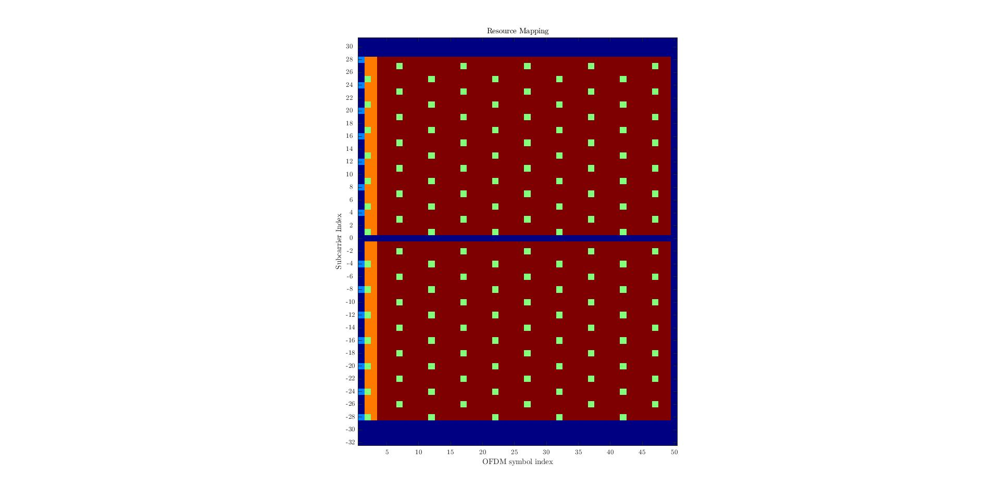

# DECT NR+ Link-Level Simulation

 

This repository contains a Matlab link-level simulation of DECT NR+ ([ETSI TS 103 636, Part 1 to 5](https://www.etsi.org/committee/1394-dect)) with the following features:

- **Transmitter**: complete physical layer, i.e. all bandwidths, MIMO modes, channel coding etc.
- **Receiver**: core physical layer functionality, i.e. packet detection, STO and CFO correction, channel estimation, channel decoding, MRC, transmit diversity etc.
- **Channel**: doubly-selective tapped delay line (TDL) model

DECT NR+ is a non-cellular radio standard and part of [5G as defined by ITU-R](https://www.etsi.org/newsroom/press-releases/1988-2021-10-world-s-first-non-cellular-5g-technology-etsi-dect-2020-gets-itu-r-approval-setting-example-of-new-era-connectivity). Introductions are available at [ETSI](https://www.etsi.org/technologies/dect), [DECT Forum](https://www.dect.org/nrplus) and [Wikipedia](https://en.wikipedia.org/wiki/DECT-2020). While commonly referred to as DECT NR+, the standard's official designation is DECT-2020 New Radio (NR).

## Table of Contents

1. [Starting](#starting)
2. [Software Requirements](#software-requirements)
3. [Directories](#directories)
4. [Example Simulation](#example-simulation)
5. [Example Simulation Results](#example-simulation-results)
    1. [Packet Error Rates](#packet-error-rates)
    2. [Resource Mapping](#resource-mapping)
    3. [Channel Interpolation](#channel-interpolation)
6. [Known Issues](#known-issues)
7. [Future Work](#future-work)

Advanced Topics

1. [BER and PER Performance References](#ber-and-per-performance-references)
2. [Synchronization](#synchronization)

## Starting

This repository can either be used locally as a standalone project, or packaged and installed system-wide as a Matlab toolbox. When used as a toolbox, name conflicts are avoided due to this project being organized in different namespaces whose names begin with the prefix **dectnrp_**.

## Software Requirements

The Matlab Communications Toolbox is required for wireless channel simulation, the LTE Toolbox for channel coding, and the Parallel Computing Toolbox for reducing simulation time.

## Directories

    ├─ +dectnrp_4_physical_layer_principles/      ETSI TS 103 636-3, Clause 4
    ├─ +dectnrp_5_physical_layer_transmissions/   ETSI TS 103 636-3, Clause 5
    ├─ +dectnrp_6_generic_procedures/             ETSI TS 103 636-3, Clause 6
    │   ├─ +lib_cc_rm_i/                          channel coding, rate matching, interleaving
    ├─ +dectnrp_7_transmission_encoding/          ETSI TS 103 636-3, Clause 7
    ├─ +dectnrp_Annex_A/                          ETSI TS 103 636-3, Annex A
    ├─ +dectnrp_channel/                          wireless channel
    ├─ +dectnrp_examples/                         basic examples
    ├─ +dectnrp_regression/                       regression testing
    ├─ +dectnrp_rx/                               receiver
    ├─ +dectnrp_sync/                             pre-fft synchronization in time domain
    ├─ +dectnrp_tx/                               transmitter
    ├─ +dectnrp_util/                             utility
    ├─ .vscode/                                   VS Code settings
    ├─ docs/                                      pictures in this README.md

## Example Simulation

Basic examples can be found in the directory [+dectnrp_examples](+dectnrp_examples):

- **single_packet.m**: Basic example demonstrating how to use the simulation.
- **ber_per_over_snr.m**: Parallel simulation of bit and packet error rates over MCS.
- **ber_per_over_snr_plot.m**: Plot results of **ber_per_over_snr.m** for PDC.

## Example Simulation Results

### Packet Error Rates
PERs of a SIMO (two receive antennas) system for different MCS over SNR in a Rician fading channel.

  

### Resource Mapping
Resource mapping of STF, DRS, PCC and PDC in the time-frequency lattice.

  

### Channel Interpolation
Interpolated average path gains for a doubly selective channel.

  

## Known Issues
- The channel coding requires verification. It is based on Matlab's LTE Toolbox.
- In an earlier version of the standard, the maximum code block size Z could be either 2048 or 6144. This functionality will be kept for the time being. In the current version of the standard, Z is limited to 2048.
- In an earlier version of the standard, the number of transmit streams was signaled by a cyclic rotation of the STF in frequency domain. This functionality will be kept for the time being. In the current version of the standard, the number of transmit streams in a packet must be tested blindly.

## Future Work
- [ ] improve speed, especially Wiener weights calculation at larger bandwidths
- [x] add regression tests for different packet configurations
- [x] implement Z=2048
- [ ] implement limited number of soft bits
- [ ] add 1024-QAM
- [ ] implement basic MIMO algorithms for NSS > 1
- [ ] residual STO estimation based on STF and DRS
- [ ] residual CFO estimation based on STF and DRS

## BER and PER Performance References

For simple channel models such as AWGN and Rayleigh flat-fading, there are closed-form BER expressions that can be used as lower BER performance bounds. Matlab's [bertool](https://de.mathworks.com/help/comm/ref/biterrorrateanalysis-app.html) can provide such theoretical BER curves. Lower bound means that the simulated/measured BER of a DECT NR+ system at a given SNR cannot fall below this lower bound. In fact, the BER tends to be worse, as a receiver must estimate and correct STO, CFO, the channel etc. which usually results in a loss of performance. If more complex channel models such as Rayleigh with frequency- and time-selective fading are simulated, this typically leads to an additional loss of performance. A total SNR loss in dB in the lower single-digit range is common.

For the PER of the Turbo decoder, exact closed-form expressions are not available. Instead, [simulated PER curves over the SNR](https://arxiv.org/abs/2104.08549) can be used. PER curves (also referred to as BLER in channel coding literature) are typically provided for the AWGN channel. This allows the performance of different implementations to be compared and serves as a lower PER performance bound.

## Synchronization

DECT NR+ packet synchronization is based on the Synchronization Training Field (STF). In this repository, synchronization is [multi-stage](https://ieeexplore.ieee.org/document/4717982). In the first stage, it consists of packet detection and a coarse peak search based on an autocorrelation of the received signal. The autocorrelation exploits that the STF consists of several regular patterns. The position of the coarse peak is also used for a correction of the fractional and integer Carrier Frequency Offset (CFO). The second stage is a fine peak search based on a cross-correlation with the STF whose shape is known to the receiver. The fine search range is limited to a small area to the left and right of the coarse peak.

Alternatively, since the introduction of the cover sequence in V1.5.1, a simplified synchronization can be carried out using only cross-correlation. The advantage of multi-stage synchronization is a reduced flop count, the advantage of cross-correlation synchronization is its performance at lower SNRs.

At high SNR, the normalized coarse metric has the following shape. Note that the metric has a much smaller amplitude at low SNRs (<6dB).
Coarse Metric with Cover Sequence | Coarse Metric without Cover Sequence
:--------------------------------:|:-----------------------------------:
  |  

The fine metric has the following shape.
Fine Metric with Cover Sequence | Fine Metric without Cover Sequence
:--------------------------------:|:-----------------------------------:
  |  

Thanks to the cover sequence, only a single fine peak remains without significant secondary peaks. Without the cover sequence, there are significant secondary peaks that can exceed the main peak at low SNR or high CFO. For this reason, in this repository, the CFO is first corrected at the coarse peak before the cross-correlation is applied. The shape of the coarse metric is not affected by a CFO.

If the entire synchronization consists only of a cross-correlation, the cross-correlation must be as short as possible (e.g. two patterns of the STF) so that the CFO does not have a significant impact on the fine peak. At the same time, the cross-correlation must not be too short, otherwise the peak will not be distinct enough at low SNR.  